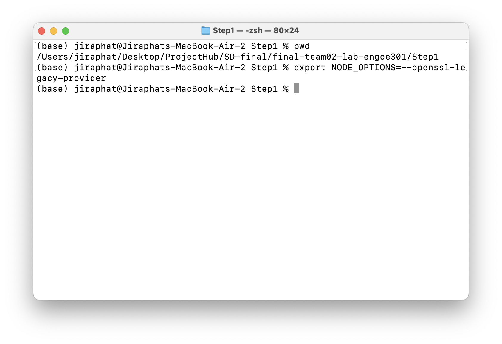
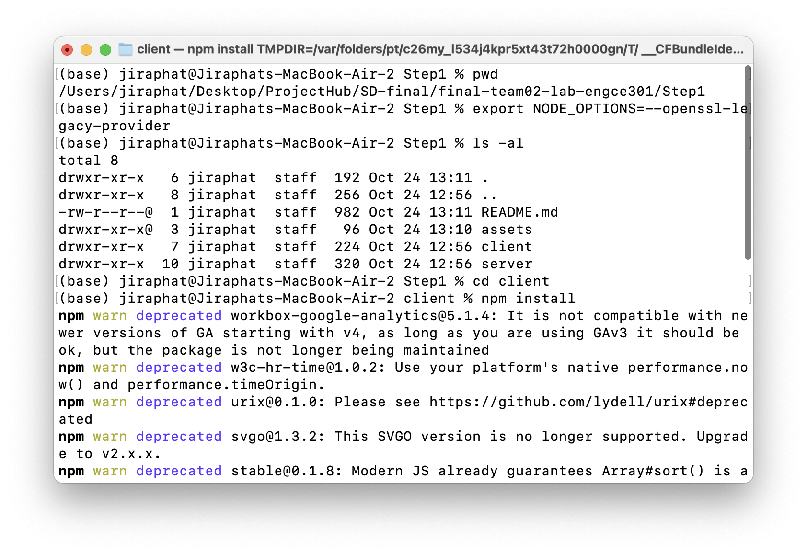
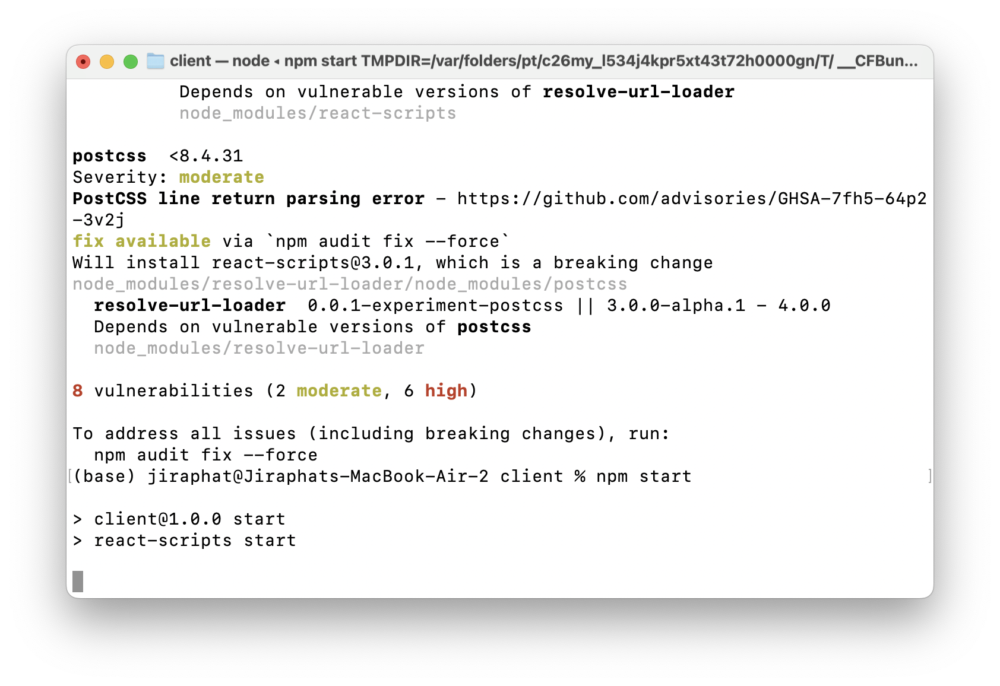
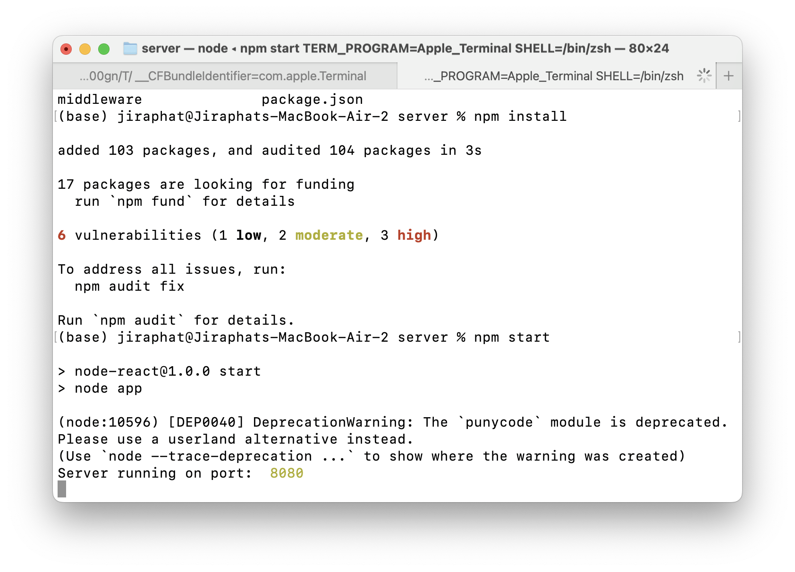
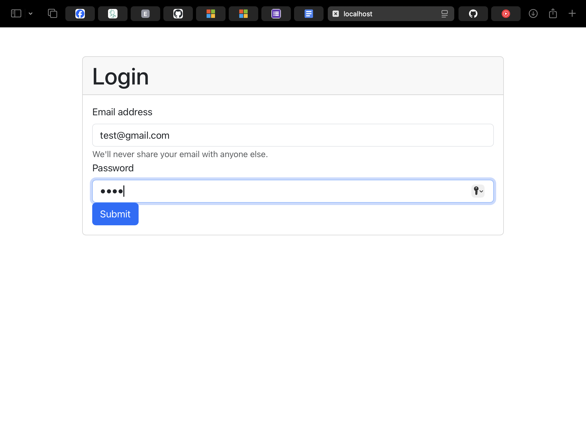
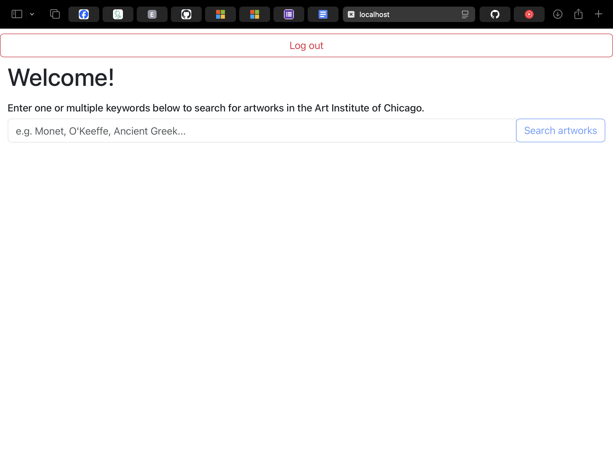
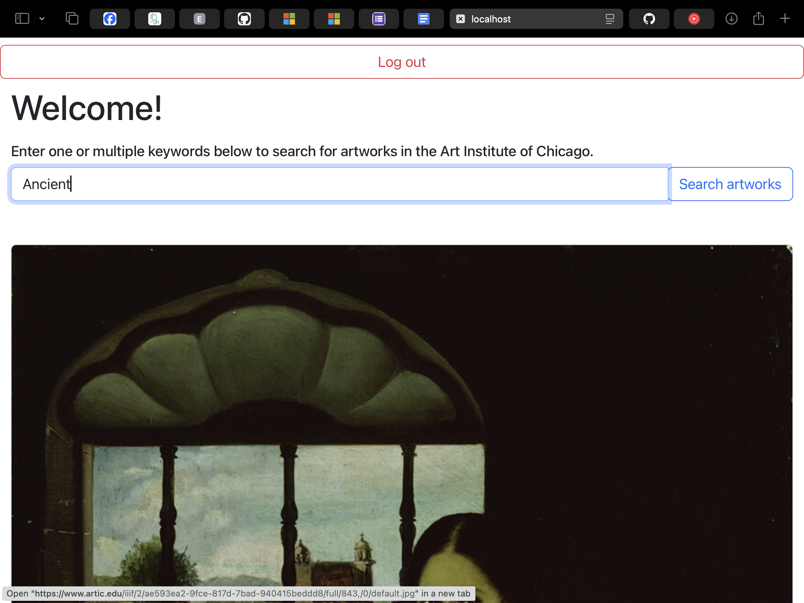

# STEP1

This work is a fork from:
[Build and Deploy a Web Application With React and Node.js+Express](https://medium.com/geekculture/build-and-deploy-a-web-application-with-react-and-node-js-express-bce2c3cfec32)

## Client 

### Before run this project, please run this command in your terminal
On Unix-like (Linux, macOS, Git bash, etc.):

    export NODE_OPTIONS=--openssl-legacy-provider

On Windows command prompt:  

    set NODE_OPTIONS=--openssl-legacy-provider

On PowerShell:
    $env:NODE_OPTIONS = "--openssl-legacy-provider"

### To Run the project execute following commands in sequence
In the project directory, you can run:

    1. npm install
    2. npm start

Runs the app in the development mode.\
Open [http://localhost:3000](http://localhost:3000) to view it in the browser.

## Server
### To Run the project execute following commands in sequence

    1. npm install
    2. npm run server

## result

