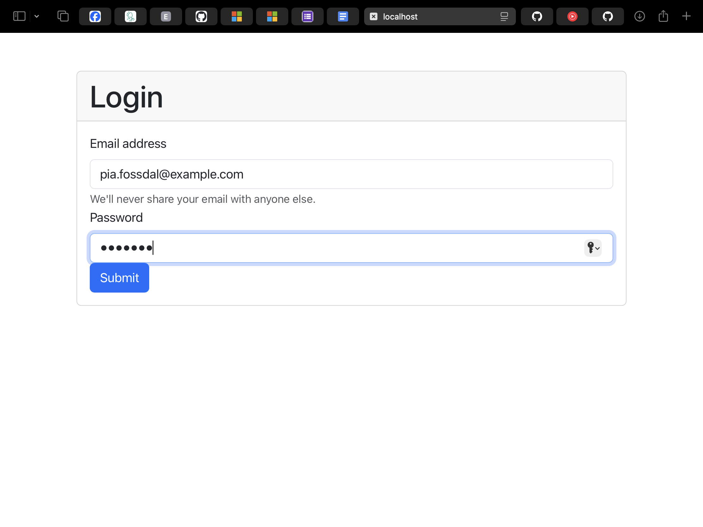

# STEP4

ให้ดัดแปลงโปรแกรมใน Step1 ทำการ Login จากฐานข้อมูลได้จริง โดยใช้ email/password ที่ใช้ทดสอบ คือ

```
user : pia.fossdal@example.com
pass : preston
```

ตัวอย่างข้อมูลใน DB


สร้าง 2 ไฟล์ ใน directory Step1/server/ และปรับปรุงให้ตรงกับที่ต้องการ

`env.js`, `dbconfig.js`


แก้ไขให้สามารถเชื่อมต่อ DB ได้ `env.js`, `dbconfig.js`

```
// env.js
module.exports = {
    DB_HOST: 'localhost',
    DB_USER: 'root',
    DB_PASSWORD: '',
    DB_NAME: 'term_project_db',
    DB_PORT: 3306
  };

// dbconfig.js
const mysql = require('mysql2');
const env = require('./env');

// สร้างการเชื่อมต่อกับฐานข้อมูล MySQL ด้วย Pool
const pool = mysql.createPool({
  host: env.DB_HOST,
  user: env.DB_USER,
  password: env.DB_PASSWORD,
  database: env.DB_NAME,
  port: env.DB_PORT,
  waitForConnections: true,
  connectionLimit: 10,
  queueLimit: 0
});

// ตรวจสอบการเชื่อมต่อ
pool.getConnection((err, connection) => {
  if (err) {
    console.error('Error connecting to MySQL:', err.stack);
    return;
  }
  console.log('Connected to MySQL as id ' + connection.threadId);
  connection.release(); // คืนการเชื่อมต่อกลับไปที่ Pool
});

module.exports = pool;

```

ใน directory Step1/server/ ติดตั้ง `npm install mysql`


แก้ไขไฟล์ `Step1/server/controllers/auth.js`

```
const { response } = require("express");
const pool = require("../dbconfig.js");

// ฟังก์ชัน login
const login = async (req, res = response) => {
  const { email, password } = req.body;

  // คำสั่ง SQL ในการค้นหาผู้ใช้งาน
  const query = "SELECT * FROM users WHERE email = ?";

  pool.query(query, [email], (err, results) => {
    if (err) {
      console.error("Error querying MySQL:", err.stack);
      return res.status(500).json({
        msg: "Database connection error",
      });
    }

    // ตรวจสอบว่าพบผู้ใช้งานหรือไม่
    if (results.length > 0) {
      const user = results[0];

      // ตรวจสอบรหัสผ่าน
      if (password !== user.password) {
        return res.status(400).json({
          msg: "User / Password are incorrect",
        });
      }

      // ถ้ารหัสผ่านถูกต้อง ตอบกลับด้วยข้อมูลผู้ใช้งาน
      return res.status(200).json({
        name: `${user.name_first} ${user.name_last}`,
        email: user.email,
        token: "A JWT token to keep the user logged in.",
        msg: "Successful login",
      });
    } else {
      // กรณีไม่พบผู้ใช้งาน
      return res.status(401).json({
        msg: "User not found!",
      });
    }
  });
};

module.exports = {
  login,
};
```


## result

กรอก email และ pass ที่กำหนด




login ผ่าน
